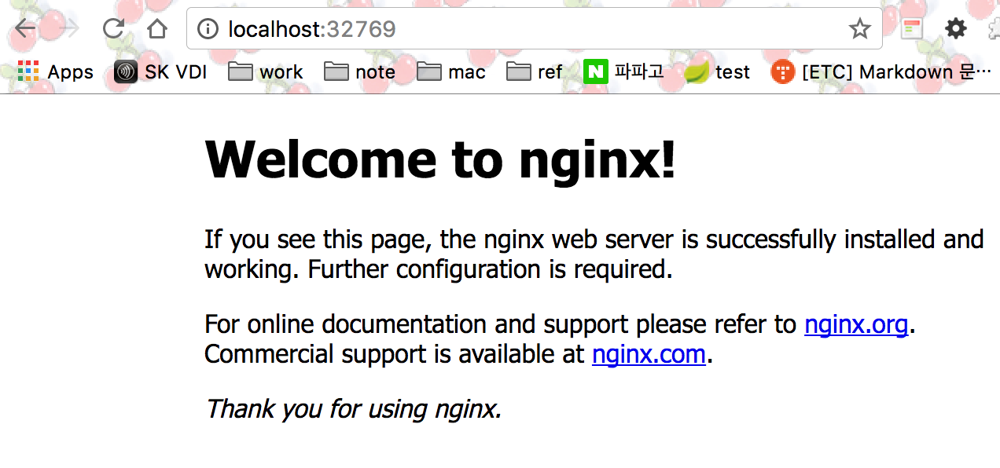

# 1일차 - 2017.03.18

## 처음 배우는 도커

### 1. Docker 이해 및 환경구성

###### What is Docker ?
리눅스컨테이너 기술을 이용해 어플리케이션 패키징, 배포를 지원하는 경량의 가상화 오픈소스 프로젝트

docker의 엔진은 go언어로 개발되었으나, 그 외는 다양한 기술을 통하여 만들어졌다고함.

많은 사람들이 가상화 도구라고 생각하고 있으나 **docker는 패키징과 배포를 위한 도구** 이다.

###### 특징
vm에 비해 이미지 파일 크기가 작아서 빠르다.
가볍다는 부분이 도커의 가장 큰 장점이 아닐까? (차후에는 IOT 장비에도 활용이 가능한 시대가??)

###### 도커의 시작
도커를 발표할 당시(2013년)에 아래의 명령어를 수행하여 데모를 보여줌.
```
$ docker run busybox echo 'Hello World'
```
해당 명령어가 수행되는 과정은 아래와 같음.
* 도커 명령어가 실행된 로컬에서 이미지를 확인하고 없으면, dokerhub에서 다운로드
* busybox 이미지로 새로운 컨테이너를 생성
* 컨테이너 시행
* TTY로 'Hello World' 출력
* 출력된 결과를 유닉스 소켓을 통해 클라이언트로 전송

##### CE(Community Edition) vs EE(Enterprise Edition)
CE 버전은 무료 버전. EE는 상용 버전


##### 도커 클라이언트
* 도커 엔진과 통신하는 thin client
* mac/windows 기반의 docker는 하이퍼바이저 기술을 기반으로 동작함. (native로 돌아가지 않음. 리눅스 기반의 경우에는 native로 돌아감.)
* kitemetic : 템플릿 기반으로 도커 컨테이너를 관리할 수 있게 해주는 gui 도커 클라이언트 (별도 설치 필요)

##### Docker Engine
어플리케이션을 컨테이너로 만들고 실행하게 해주는 데몬
(소켓방식으로 통신하는 도커 데몬으로 생각해도됨. 하지만, 역할이 많음)


##### Docker Hub
github와 같이 docker 이미지를 관리하는 저장소.
https://hub.docker.com

### 2. Docker 이미지
* 컨테이너를 만들기 위한 것
* 도커이미지는 파일시스템이다. 근데 하나가 아니고 여러 개가 층층이 쌓여있는 레이어 파일 시스템이다.
* 읽기 전용이다.

##### Base Image
* 모든 이미지는 base image가 있어야 한다.
* from 스크레치 - 아무것도 없이 시작할 수 있게 해줌.
* 처음에는 우분투로 시작했다가 alpine으로 변경되었음. (이유* 는 용량이 작아서. 기본이미지가 크면 도커의 총 이미지가 커지게 될 수 있음)

##### Image Layers
* base image 위에 내가 원하는 이미지를 층층이 쌓는다. (여기까지는 read only image)
* 몇개의 이미지로 구성되어있는 지를 cli를 이용하여 확인할 수 있다. (json 형태로 보여준다)

도커는 변경된 부분만 저장이 되는데...
도커는 변경된 부분만 별도로 저장한다 (왜 가능?? 각각이 이미지로 구성이 되어있으니까...???)

그 위에 writeable image가 생기는데 그걸 container라고 함.

##### Dockerfile
도커 이미지를 만들기 위해 설치할 SW, 필요할 설정을 정의하는 파일
도커파일 내에서는 대소문자를 구분하지 않음. 하지만 도커의 명령어와 구분하기 위해서 도커 명령어는 대문자로 작성하는 것을 권고함.

###### 이미지 검색
https://hub.docker.com/ 에서도 검색 가능.
cli 에서는 아래와 같이 검색 가능 (아래의 명령어는 whalesay에 해당하는 이미지를 검색)
```
$ docker search whalesay
```
hub에 저장된 도커이미지를 가져오는 방법은 아래와 같으며, 별도로 가져올 버전을 명시하지 않으면 최신으로 가져온다.
(가능하면 다운받을 버전에 대한 tag를 명시하는 것을 권장)
```
$ docker pull docker/whalesay
Using default tag: latest
latest: Pulling from docker/whalesay
e190868d63f8: Pull complete
909cd34c6fd7: Pull complete
0b9bfabab7c1: Pull complete
a3ed95caeb02: Pull complete
00bf65475aba: Pull complete
c57b6bcc83e3: Pull complete
8978f6879e2f: Pull complete
8eed3712d2cf: Pull complete
Digest: sha256:178598e51a26abbc958b8a2e48825c90bc22e641de3d31e18aaf55f3258ba93b
Status: Downloaded newer image for docker/whalesay:latest
```

저장된 이미지를 확인하는 방법은..
```
$ docker images
REPOSITORY          TAG                 IMAGE ID            CREATED             SIZE
hello-world         latest              48b5124b2768        2 months ago        1.84 kB
docker/whalesay     latest              6b362a9f73eb        22 months ago       247 MB
```

도커 이미지를 실행하는 방법이고, 'cowsay boo'는 추가적인 명령어임.
* cowsay 는 고래를 그리라는 것.
* boo 는 메시지
```
$ docker run docker/whalesay cowsay boo
_____
< boo >
-----
   \
    \
     \
                   ##        .
             ## ## ##       ==
          ## ## ## ##      ===
      /""""""""""""""""___/ ===
 ~~~ {~~ ~~~~ ~~~ ~~~~ ~~ ~ /  ===- ~~~
      \______ o          __/
       \    \        __/
         \____\______/
```

###### 이미지 만들기
로컬에 이미지 파일 만들기
```
cat Dockerfile
FROM docker/whalesay:latest

RUN apt-get -y update
RUN apt-get install -y fortunes

CMD /usr/games/fortune -a | cowsay
```

만든 이미지 빌드하기
* 빌드 시에 기본으로 찾는 이미지파일명이 *Dockerfile* 이다. 만약, 별도의 파일명으로 생성해서 빌드 시 지정할 수 있다고는 함(방법은 찾아봐야할듯)
```
dockekr build -t <이미지 이름> .
docker build -t docker-whale .
--> 현재 디렉토리의 Dockerfile이라는 파일을 가지고  docker-while 이라는 이미지로 빌드하겠다.
```

아래와 같이 생성한 이미지를 확인할 수 있음.
```
docker images
REPOSITORY          TAG                 IMAGE ID            CREATED             SIZE
docker-whale        latest              b634bf4b901f        39 seconds ago      277 MB
hello-world         latest              48b5124b2768        2 months ago        1.84 kB
docker/whalesay     latest              6b362a9f73eb        22 months ago       247 MB
```

생성한 이미지를 실행
```
$ docker run docker-whale
 _________________________________________
/ Benny Hill: Would you like a peanut?    \
| Girl: No, thank you, I don't want to be |
| under obligation. Benny Hill: You won't |
| be under obligation for a peanut.       |
|                                         |
| It's not as if it were a chocolate bar  |
\ or something.                           /
 -----------------------------------------
    \
     \
      \
                    ##        .
              ## ## ##       ==
           ## ## ## ##      ===
       /""""""""""""""""___/ ===
  ~~~ {~~ ~~~~ ~~~ ~~~~ ~~ ~ /  ===- ~~~
       \______ o          __/
        \    \        __/
          \____\______/
```


#### docker 명령어
ADD : 압축파일을 복사한 뒤, 압축해제까지 함.
COPY : 그냥 복사만 한다.
ENTRYPOINT : 특정 쉘 스크립트 실행 후에 (cmd와 비슷한데 좀 더 많이 사용된다고...)
VOLUME : 리눅스의 mount와 비슷한 명령어라고 생각하면 됨.
WORKDIR : RUN 명령어가 실행될 위치를 지정. cd로 이동해도 되지만 편의를 위해 별도로 명령어가 존재한다는 듯.
ONBUILD : 이미지 실행 후에 패키지를 최신으로 업데이트 한다던가 할때 사용한다고 (근데 자주 사용하지는 않는다고)

#### 이미지 삭제
이미지를 참조하는 컨테이너가 있으면 삭제를 할 수 없다.
docker rm : 컨테이너를 삭제
docker rmi : 이미지를 삭제
docker rmi -f : 이미지를 참조하는 컨테이너가 있어도 강제로 삭제 (사용하는 것을 권장하지 않음)

#### 도커 이미지 크기를 줄이는 방법
* run 명령어를 각각이 쓰는 것보다 체인으로 사용하는 것을 권장.
run 명령어 각각 하나가 하나의 계층이 쌓이는 것이라고 보면 됨.
ex. RUN 명령어 && 명령어
그렇다고 무작정 run 한줄에 모든 명령어를 넣는 것은 좋지 않다.
* maven과 같은 빌드도구를 설치하지 말아라

### 3. Docker 컨테이너
이미지를 실행한 상태
컨테이너는 가상서버가 아니다.

###### docker 로그 보기
```
docker logs <container id>
```

###### 디비 컨테이너 실행
-e : 환경 변수 지정
-d : 컨테이너를 데몬으로 실행하기 위한 옵션
```
$ docker run -e MYSQL_ROOT_PASSWORD='Passw0rd' --name mydb -d mysql:5.6
```

###### nginx 컨테이너 실행
-p : 내가 지정해서 포트 바인딩 (호스트에서 사용할 포트:내부 이미지의 포트)
-P : 자동으로 포트를 바인딩해줌
```
$ docker run --name myweb -d -p 8001:80 nginx
$ docker run -d -P nginx
```

아래와 같이 생성하면 외부에서 내부로 접근이 가능하도록 포트포워딩을 해준다.
```
$ docker run -d -P nginx
$ docker ps -a
CONTAINER ID        IMAGE               COMMAND                  CREATED             STATUS              PORTS                                           NAMES
aa98e8687fa0        nginx               "nginx -g 'daemon ..."   4 seconds ago       Up 3 seconds        0.0.0.0:32769->80/tcp, 0.0.0.0:32768->443/tcp   dazzling_wing
```
아래와 같이 웹으로 접속하여 확인할 수 있다.
  


###### 로그 확인
```
$ docker logs myweb
172.17.0.1 - - [18/Mar/2017:09:01:46 +0000] "GET / HTTP/1.1" 200 612 "-" "Mozilla/5.0 (Macintosh; Intel Mac OS X 10_12_3) AppleWebKit/537.36 (KHTML, like Gecko) Chrome/56.0.2924.87 Safari/537.36" "-"
2017/03/18 09:01:46 [error] 7#7: *1 open() "/usr/share/nginx/html/favicon.ico" failed (2: No such file or directory), client: 172.17.0.1, server: localhost, request: "GET /favicon.ico HTTP/1.1", host: "localhost:8001", referrer: "http://localhost:8001/"
172.17.0.1 - - [18/Mar/2017:09:01:46 +0000] "GET /favicon.ico HTTP/1.1" 404 572 "http://localhost:8001/" "Mozilla/5.0 (Macintosh; Intel Mac OS X 10_12_3) AppleWebKit/537.36 (KHTML, like Gecko) Chrome/56.0.2924.87 Safari/537.36" "-"
```


* docker의 기본사용자는 docker 이다.

* 실제로는 여러개의 컨테이너를 띄우고, 각각의 컨테이너가 서로 연관을 갖도록 연결시킨다.


##### jenkins 컨테이너 생성해서 nginx 컨테이너와 연결하기
```
$ docker run -d -p 8085:8080 -p 5001:5000 --name myjenkins jenkins
```
기존의 다른 컨테이너와 연결하려면..link 옵션을 추가해준다.
```
$ docker run --name myweb -d -p 8001:80 --link myjenkins:jenkins nginx
```

만약, 위와 같이 링크를 햇을 때, nginx를 proxy 서버로 사용하기 위해서는 nginx.conf를 수정해서 설정해주어야 한다.

#### 컨테이너 생성 시의 설정들 확인하기
```
$ docker inspect <컨테이너 이름>
```

### 4. Docker로 꾸미는 로컬 환경
호스트 서버 하나에 여러 개의 컨테이너를 가져가는 것은 좋지 않음
호스트:컨테이너를 1:1 로 가져가는 것이 좋음.

도커 컨테이너가 크래쉬로 죽을 경우에...기동 당시의 옵션에 따라 두거나 무조건 살리도록 할 수 있음.
''물리 서버에 바로 도커 엔진을 활용하여 띄우는 방법 vs 물리 서버에 가상머신을 띄우고 그 위에 도커 엔진을 활용하여 띄우는 방법''이 있는데.....무엇이 좋다고 할 수는 없는 듯....
단, 도커엔진을 바로 물리 서버에 띄우는 경우 컨테이너가 다수가 있다면.....이 경우에는 노는 놈이 대부분이면 일하는 놈이 물리 서버의 자원을 많이 사용할 수 있음.???
도커 엔진이 물리서버를 죽일 수 없는 구조로 권한레벨이 설정되어 있다고 이론적으로 나와있다고..

도커 엔진도 죽을 수 있음 - 기동 시 죽었을 때의 동작에 대해 옵션을 줄 수 있음.

#### 컨테이너 데이터 백업
* 컨테이너는 프로세스 이다.
* 서비스를 사용할 때는 cattle 처럼 사용해라. (pet은 애지중이. cattle은 방목?).
즉, 클라우드에서의 컨테이너는 문제 생기면 그냥 kill 하고 다시 만들어서 띄우고....
그러므로 **데이터 백업이 중요**함.

* docker의 '-v'옵션을 이용하여 백업할 수 있음.
(-v : 볼륨 바인딩 옵션. 컨테이너의 특정 디렉토리와 호스트의 특정 디렉토리를 연결해준다)
```
$ docker run -e MYSQL_ROOT_PASSWORD='Passw0rd' --name mydb -d -v /Users/hyena/Documents/study/mysqldata:/var/lib/mysql -P mysql:5.6
```
생성 후에 확인해보면....아래와 같이 백업파일이 생성된 것을 확인할 수 있다.
* 근데 내 로컬에서 아래와 같이 확인되는 이유는 docker for mac이 사용자 편의를 위해서 native 처럼 매핑해주기 때문.
```
[hyena@hyenaui-MacBook-Pro:~/Documents/study/mysqldata]$ ls -lrt
total 221192
-rw-rw----   1 hyena  staff  50331648 Mar 18 18:47 ib_logfile1
drwx------  55 hyena  staff      1870 Mar 18 18:47 performance_schema
-rw-rw----   1 hyena  staff        56 Mar 18 18:47 auto.cnf
drwx------  81 hyena  staff      2754 Mar 18 18:47 mysql
-rw-rw----   1 hyena  staff  12582912 Mar 18 18:47 ibdata1
-rw-rw----   1 hyena  staff  50331648 Mar 18 18:48 ib_logfile0
```

한글 인코딩 타입 등 설정파일을 변경하였을 때...특정 conf 파일을 읽어서 mysql 컨테이너의 설정을 바꾸고 싶을때..
볼륨바인딩을 이용하여 컨테이너를 생성한다.

** 여러 개의 도커 머신이 존재하는 상태에서...볼륨바인딩 옵션으로 호스트의 경로를 지정할 때..도커가 어떤 머신의 것인지 어떻게 알까? 'docker-machine env'을 실행하면 확인되는 default로 정의된 호스트에게 매핑을 해준다.
** 그러나 docker for mac 의 경우에는 도커 머신을 1대만 생성이 가능하므로 별도로 설정안해줘도~~


* 가능한 사용자는 docker( 도커 기본 사용자) 를 사용하는 것을 권장.


#### 데이터 컨테이너 생성
특정 디렉토리를 공유하는 데이터 컨테이너를 만들 수 있고,
해당 디렉토리를 참조하는 컨테이너 생성도 가능하다.
```
$ docker run --name mydata -v /Users/hyena/app1 busybox true
```
true : 항상 참이라는 옵션을 넣어주는 것??

## Docker Machine
docker for mac 과 toolbox를 이용한 케이스가 도커머신이 동작하는 방식이 다르다??
* boot2docker를 이용하여 도커머신을 생성한다.
2013년도에는 boot2docker를 설치 후에 도커머신을 설치할 수 있었음.

#####
driver 라는 것을 지원하므로 다양한 vm을 지원한다


## Docker Compose
실제로 운영 시에는 여러개의 컨테이너를 띄우고 사용함.
이런 여러개의 컨테이너를 쉽게 사용할 수 있게 도와주는 도구
docker 설치 시에 같이 설치되고, 또는 curl을 이용하여 직접 설치도 할 수 있다.
각 compose 버전마다 지원가능한 명령어나 기능이 다르다.

###### docker-compose.yml
도커 컨테이너 생성 시, 컨테이너에 대한 설정 정보를 yml 파일로 정의해서 생성할 수 있다.
버전 구분 법 : ver1 은 파일에 버전 표기 명시가 없으며 그 이후 버전에는 버전이 명시되어 있다.
version3 : 멀티클러스터에서 많이 사용

단점 : 네트워크로 명령이 날라가지 않음. 멀티 호스트 미지원

docker-compose 자체를 컨테이너로도 설치할 수 있음.
