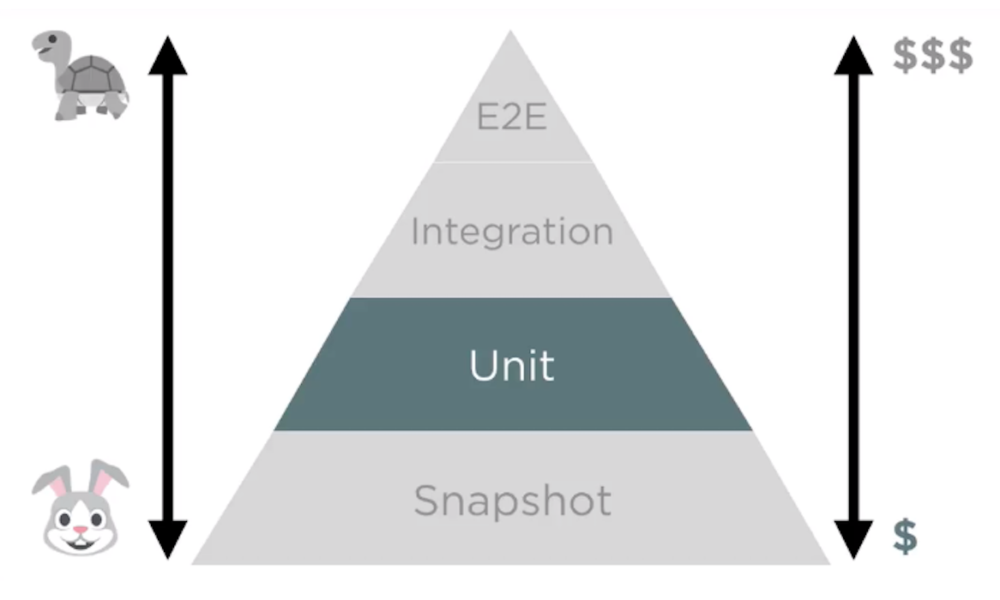
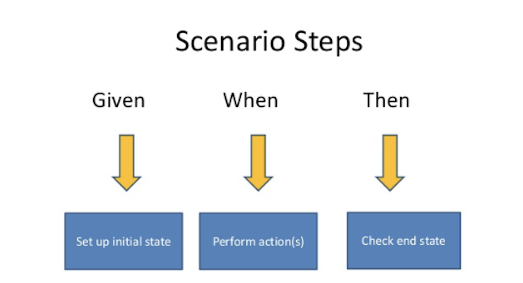
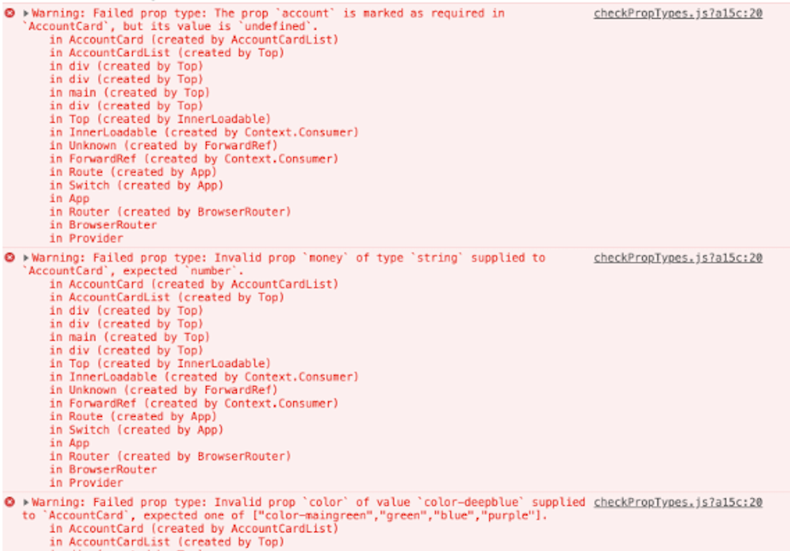

* TOC
{:toc}



React 환경에서의 단위 테스트를 작성하기 위해서 어떠한 방식으로 접근하고 작성해야 하는 지에 대해 조사한 내용을 정리한 글이다.

## 단위 테스트란...?

단위 테스트는 모듈이나 애플리케이션 안에 있는 개별적인 코드 단위가 의도하는 데로 올바로 동작하는 지를 확인하기 위한 방법으로 보통 개발자가 작성하고 수행한다.

### React에서의 단위 테스트

React 환경에서 어떠한 동작을 검증해야 하는 지에 대해 생각해보면, 아래의 동작에 대한 부분을 검증하기 위해 작성한다고 정의할 수 있다.

- Testing basic component rendering
- Testing props
- Testing state
- Testing event handlers

### 테스트로 인하여 가져올 수 있는 효과

- 작성한 테스트 코드를 기반으로 테스트 대상에 대한 로직을 설명할 수 있다.
- 리팩토링을 좀 더 자신있게 할 수 있다.
- 작은 변화가 발생하더라도 테스트를 통하여 확인할 수 있다.

## 좋은 테스트의 조건

발췌: https://meetup.toast.com/posts/174

테스트의 기회 비용을 가늠해보기 위해서는 좋은 테스트가 무엇인지를 알아야 한다.
어떤 테스트 코드를 작성하느냐에 따라서 작성이나 유지보수에 드는 비용도 다르고 얻을 수 있는 효과도 다르기 때문이다.

**실행 속도가 빨라야 한다.**
테스트의 실행 속도가 빠르다는 것은 코드를 수정할 때마다 빠른 피드백을 받을 수 있다는 의미이다.
이는 개발 속도를 빠르게 하고, 테스트를 더 자주 실행 할 수 있도록 한다.
결과를 보기 위해 수십 분을 기다려야하는 테스트는 개발 과정에서 거의 무용지물에 가깝다고 볼 수 있다.

**내부 구현 변경 시 테스트가 깨지지 않아야 한다.**
이 말은 `인터페이스를 기준으로 테스트를 작성하라` 거나 `구현 종속적인 테스트를 작성하지 말라`는 지침과 같은 맥락이라 볼 수 있다.
좀 더 넓은 관점에서는 테스트의 단위를 너무 작게 쪼개는 경우도 해당된다. 작은 리팩토링에도 테스트가 깨진다면 코드를 개선할 때 믿고 의지할 수 없을 뿐 아니라, 오히려 테스트를 수정하는 비용을 발생시켜 코드 개선을 방해하는 결과를 낳게 된다.

**버그를 검출할 수 있어야 한다.**
달리 표현하면 `잘못된 코드를 검증하는 테스트는 실패해야 한다` 라고 할 수 있다. 
테스트가 기대하는 결과를 구체적으로 명시하지 않거나 예상 가능한 시나리오를 모두 검증하지 않으면 제품 코드에 있는 버그를 발견하지 못할 수 있다. 또한 모의 객체(Mock)을 과하게 사용하면 의존성이 있는 객체의 동작이 바뀌어도 테스트 코드가 연결 과정에서의 버그를 전혀 검출하지 못하게 된다.
그러므로 테스트 명세는 구체적이어야 하며, 모의 객체의 사용은 최대한 지양하는 것이 좋다.

**테스트의 결과가 안정적이어야 한다.**
어제 성공했던 테스트가 오늘은 실패하거나, 특정 기기에서 성공했던 테스트가 다른 기기에서는 실패한다면 해당 테스트를 신뢰할 수 없을 것이다. 즉, 테스트는 외부 환경의 영향을 최소화해서 언제 어디서 실행해도 동일한 결과를 보장해야 한다. 이러한 외부 환경은 현재 시간, 현재 기기의 OS, 네트워크 상태 등을 포함하며, 직접 조작할 수 있도록 모의 객체나 별도의 도구를 활용해야만 한다.

**의도가 명확히 드러나야 한다**
제품 코드의 가독성이 중요하다는 것은 이제 누구나 인정하는 사실이다. 좋은 품질의 코드는 `기계가 읽기 좋은 코드`가 아닌 `사람이 읽기 좋은 코드`이다.
테스트 코드도 품질을 높이기 위해 제품 코드와 동일한 기준을 갖고 관리해야 한다.
즉, 테스트 코드를 보고 한 눈에 어떤 내용을 테스트하는지를 파악할 수 있어야 한다. 그렇지 않으면 추후에 해당 코드를 수정하거나 제거하기가 어려워져서 관리 비용이 늘어나게 된다.
테스트 준비를 위한 장황한 코드가 반복해서 사용되건나 결과를 검증하는 코드가 불필요하게 복잡하다면 별도의 함수 또는 단언문을 만들어서 추상화시키는 것이 좋다.

## 테스트 시나리오 작성 규칙



- BDD(Behavior Driven Development)를 기준으로 테스트 코드를 작성한다.
- 각각의 테스트는 다른 테스트에 의존적이지 않아야 한다.
- Mock, Dummy 등을 사용하여 API, LocalStorage에 의존적인 부분을 대체하여 작성한다.
- 각각의 테스트 코드는 의도가 명확해야 한다. 즉, 테스트 코드를 보고 컴포넌트의 기능을 파악할 수 있어야 한다.

## React Component를 테스트 하기 위한 방법

PropTypes를 이용하여 정작 타입 검사를 수행하고, Jest와 같은 단위 테스트 도구를 이용하여 논리적인 검사를 수행할 수 있다.

### PropTypes를 이용한 유효성 검사

[prop-types](https://reactjs.org/docs/typechecking-with-proptypes.html)를 이용하여 각 컴포넌트에서 전달받는 props의 유효성 검사를 하는 방법이 으로 개발 모드에서만 동작한다.

PropTypes를 적용함으로써 가져올 수 있는 이점은 아래와 같다.

- 컴포넌트 간에 주고 받는 props를 체크하여 사전에 버그를 예방할 수 있다.



- 상세한 PropTypes 정의로 인하여 코드의 가독성을 향상시킬 수 있다.

#### Installation

React v15.5부터 별도의 PropTypes 라이브러리로 분리되었으므로 아래와 같이 설치를 해주어야 한다.

```bash
npm install --save prop-types
```

#### Example

```javascript
import React from 'react';
import PropType from 'prop-types';

class AccountList extends React.PureComponent {
    //...SKIP...
}

AccountList.defaultProps = {
    account: {},
    hiddenAccountId: null,
    onClickAccount: () => {},
    onChangeAccount: () => {},
};

AccountList.propTypes = {
    accounts: PropType.array.isRequired,
    account: PropType.object,
    hiddenAccountId: PropType.string,
    // dispatch event when click the account
    onClickAccount: PropType.func,
    // dispatch event when chang the account value
    onChangeAccount: PropType.func,
};

export default AccountList;
```

사용법에 대한 자세한 내용은 [https://www.npmjs.com/package/prop-types#usage](https://www.npmjs.com/package/prop-types#usage)를 참고한다.

### 논리적인 검사 수행하기 위한 단위 테스트 도구

React Component 테스트를 위해서는 Jest가 테스트 프레임워크로 가장 많이 사용되고 있으며, 컴포넌트 렌더링 등과 같은 동작을 위해서는 Enzyme, @testing-library/react 등과 같은 테스트 라이브러리가 사용되고 있다.

- [Jest](https://jestjs.io/)
    - Facebook에서 [Jasmine](https://jasmine.github.io/)을 기반으로 개발한 *JavaScript Test Framework*이다.
- [Enzyme](https://github.com/airbnb/enzyme)
    - Airbnb에서 개발한 React를 위한 *JavaScript Testing utility*이다.
    - 컴포넌트 렌더링을 위해 아래와 같은 메소드가 제공된다.
        - shallow - 자기 자신만 렌더링을 하므로 독립적으로 해당 컴포넌트만 독립적으로 테스트할 수 있다.
        - mount - 관련된 컴포넌트를 모두 렌더링 한다. 다른 컴포넌트와의 관계를 테스트 할 수 있다.
        - render - 컴포넌트를 정적인 html로 렌더링한다.
- [react-testing-library](https://github.com/testing-library/react-testing-library)
    - 가벼운 라이브러리 모듈로써, 리팩토링 시에 테스트 코드가 깨지는 것을 방지하기 위해 *구성 요소의 기능을 테스트하기 위한 코드를 작성*하도록 강요하고 있다.
    - state, props를 체크하지 않고, 사용자에게 보여지는 dom객체를 이용하여 검증한다.
    - render 메소드만 제공
        - mount, shallow와 같은 렌더링 메소드를 제공하지 않음

### Filename Conventions

일반적으로 다음과 같은 규칙으로 파일명을 작성하며, 테스트 도구들이 다음의 규칙을 기준으로 테스트 스크립트 파일을 찾아 실행한다.

- Files with .js suffix in **tests** folders.
- Files with .test.js suffix.
- Files with .spec.js suffix.

> Jest를 사용하는 경우, `jest.config.js` 파일의 `testMatch` 설정을 이용하여 테스트 파일을 규칙을 정의할 수 있다. (https://jestjs.io/docs/en/configuration#testmatch-array-string)

### Snapshot Test

렌더링된 결과물을 텍스트 파일에 저장하여, 다음 테스트 시에 이전의 결과물과 비교하여 변경이 발생하는 경우에 에러를 발생시킴으로써 컴포넌트의 의도치 않은 변경을 추척할 수 있다.

- 장점
    - 테스트를 작성하기 쉽다
    - 의도치 않은 변경을 빠르게 감지할 수 있다
- 단점
    - 테스트에 대한 명확한 의도를 파악하기 어렵다
    - 작은 변경에도 오류가 발생할 수 있으므로, 컴포넌트의 변경이 자주 발생하는 경우에는 유지보수 비용이 증가하는 현상이 발생하므로 적합하지 않을 수 있다.
    - 테스트 실패 시, 버그로 인지하지 않고 snapshot을 업데이트 하여 해결해버릴 수도 있다

## References

- [Create React App - Running Tests](https://facebook.github.io/create-react-app/docs/running-tests)
- [React 컴포넌트를 테스트하는 세 가지 방법](http://webframeworks.kr/tutorials/react/testing/)
- [Toast Meetup - 실용적인 프론트엔드 테스트 전략](https://meetup.toast.com/posts/174)
- [번역-리액트 테스팅 튜토리얼: 테스트 프레임워크와 컴포넌트 테스트 방법](https://rinae.dev/posts/react-testing-tutorial-kr)
- [YouTube - React Redux Unit & Integration Testing with Jest and Enzyme](https://www.youtube.com/playlist?list=PL-Db3tEF6pB8Am-IhCRgyGSxTalkDpUV_)
    - enzyme를 이용하여 작성하고자 하는 경우 해당 영상이 도움이 될 듯.  